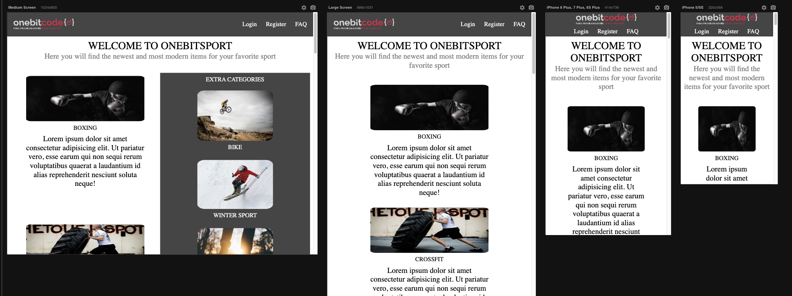
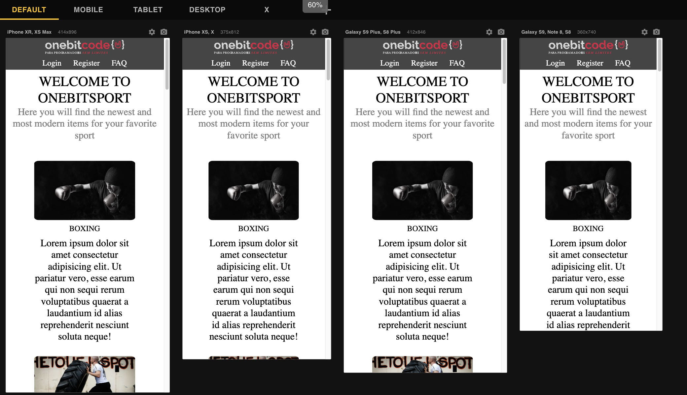

# OneBitSport Landing Page

This landing page, called OneBitSport, was created with the purpose of applying the concepts of grid and flex together.
The application's interface adjusts dynamically to different screen sizes and devices.The project also utilized Sass for styling.

The main goal of this project was to put into practice the concepts learned during the grid, flex, and Sass modules of the OneBitCode course.

### Responsive Web Design
<hr>

<hr>


## Technologies Used

The following technologies were used in the development of this landing page:

- HTML: Used for structuring the web page.
- Sass: Used for styling the web page.

Feel free to explore the code and make any modifications or enhancements as needed.

## How to Use

To use this project, follow these steps:

1. Clone the repository to your local machine.
2. Open the project in your preferred code editor.
3. Customize the HTML and Sass files according to your requirements.
4. Compile the Sass code into CSS (if necessary) using a Sass compiler or build tool.

   - If you don't have Sass installed on your system, you can install it by running the following command in your terminal:

     ```
     npm install -g sass
     ```

   - Once Sass is installed, you can use the following command to compile your Sass files:

     ```
     sass --watch sass/style.scss:css/style.css
     ```

   This command will watch for changes in the `style.scss` file inside the `sass` folder and compile it into CSS, generating the `style.css` file inside the `css` folder.

5. Open the HTML file in a web browser to view the landing page.

By following these steps, you'll be able to customize the project, compile the Sass code (if necessary), and view the landing page in your web browser.


## Acknowledgements

This project was created as a learning exercise and is based on the concepts taught in the OneBitCode course. Special thanks to the OneBitCode team for providing valuable educational resources.

